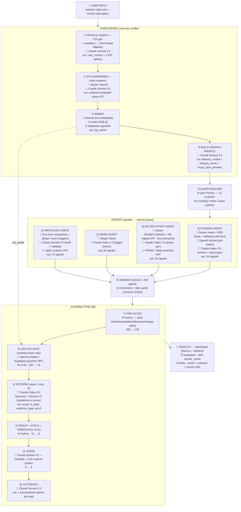

# cnvrted V2 — Architecture & Orchestration (11fps live values)

## How to use this
- **Excalidraw:** Menu → "Generate diagram" / paste the Mermaid block into a Mermaid-to-Excalidraw import.
- **Miro:** paste the Mermaid block into a Mermaid plugin, OR paste the "Miro AI prompt" at the bottom.
- The **Appendix** has each box's REAL input / REAL prompt (abridged) / REAL output from a live 11fps run.
- 📁 **FULL VERBATIM PROMPTS** for every agent are in the **`prompts/`** folder next to this file
  (one file per box, extracted straight from the running code — `prompts/README.md` maps file → box).

---

## MERMAID FLOWCHART (paste into Excalidraw → Mermaid)

---

# TECH STACK — external services & models (what each agent uses)

| Service / Model | Type | Used by |
|---|---|---|
| **Claude Sonnet 4.5** (`claude-sonnet-4-5`) | LLM (quality) | ① ICP gen, ② ICP sharpen, ④ search-profile, Ⓓ watchlist build+validate, ⑨ borderline re-score, ⑪ judge, ⑫ outreach |
| **Claude Haiku 4.5** (`claude-haiku-4-5`) | LLM (fast/bulk) | Ⓐ funding extract+query-gen, Ⓒ news extract, Ⓑ buyer query-gen, ⑨ primary scoring |
| **OpenAI `text-embedding-3-small`** | Embeddings (1536-d) | ③ ICP vector, ⑧ signal vector for the vector gate |
| **Serper** (`google.serper.dev` /news + /search) | Web/News search API | ② client research, Ⓐ funding, Ⓒ news, Ⓑ Reddit+LinkedIn, Ⓓ watchlist triggers |
| **Exa** (`exa-py`) | Neural/semantic search | Ⓑ buyer-intent semantic search, Ⓓ live company discovery |
| **crawl4ai** (→ **Jina Reader** fallback) | Headless web crawl | ① website crawl (crawl4ai fails on Windows → Jina) |
| **trafilatura** | Article full-text extraction | Ⓐ funding (clean article body before extraction) |
| **HackerNews Algolia API** (`hn.algolia.com`) | Free post search | Ⓑ buyer-intent |
| **Supabase** (Postgres + **pgvector**) | DB + vector match RPC | profiles, watchlist, competitors, query_performance; ⑧ `match_profiles` |
| **FastAPI** + in-memory queue + disk `results_cache` | Backend / orchestration | the whole pipeline (port 8001) |
| **Next.js + Tailwind** | Frontend dashboard | results UI (port 3000) |
| 💤 **Apify** (cookieless LinkedIn actors) | Contact enrichment | wired but DISABLED (cost/hang) — on-demand only |
| 💤 **Reddit PRAW** | Reddit API | scaffolded but OFF (no creds; Reddit comes via Serper) |

**Legend in the diagram:** 🧠 = LLM call · 🔧 = external API/tool · 🗄️ = datastore · ⚙️ = pure Python (no external call) · 💤 = wired but currently off.

---

# APPENDIX — actual input / prompt / output per box (11fps live run)

## ① PROFILE AGENT — ICP generation
**INPUT (actual):** crawled 11fps.com (crawl4ai failed on Windows → Jina fallback) + LinkedIn + `service_description`. Website quality flagged OK/EMPTY so Claude knows what to trust.
**PROMPT (actual, profile_agent SYSTEM_PROMPT, abridged):**
> "You are a B2B sales intelligence expert specialising in agency outbound and intent-based targeting… Produce: (1) UserContext.md — a sharp internal profile of this seller (what they sell, tone, differentiators); (2) 3 ICP options labelled Broad / Niche / Signal-Based…"
**OUTPUT (actual):** user_context (1529 chars) + 3 options:
- *Broad:* "Digital audio platforms, D2C mobile apps, regional entertainment studios, creator…"
- *Niche:* "Audio streaming platforms focused on regional language content (Hindi, Telugu)…"
- *Signal-Based:* "NO INDUSTRY FILTER. PURE TRIGGER DETECTION."

## ② ICP SHARPENER — client research (NEW; the orangeslice.ai gap-closer)
**INPUT (actual):** approved Broad ICP + lookalike clients `[Pocket FM, Kuku FM, Zee Studios, People Media Factory]`.
**SUB-STEP `research_clients` (actual, Serper):** looked each up →
- Pocket FM: "world's #1 audio series platform, 200M+ listeners, AI+human"
- Kuku FM: "audiobooks & podcasts, viral audio series"
- Zee Studios: "film production, promotions, distribution"
- People Media Factory: "Entertainment production company"
**PROMPT (actual `SHARPEN_PROMPT`, abridged):**
> "The CURRENT ICP was auto-derived from the marketing homepage, so it's TOO BROAD. RE-DERIVE an EVIDENCE-WEIGHTED ICP grounded in who the seller ACTUALLY serves… Identify the COMMON PATTERN at SECTOR + SITUATION level. Do NOT over-narrow to one client's label (if 2 clients are audio apps, the core is still 'media & entertainment scaling high-volume video' incl. microdrama/vertical-video/OTT)…"
**OUTPUT (actual):**
> "CORE ICP: Digital entertainment platforms scaling high-volume video content — Indian digital media companies (audio platforms, streaming studios, creator networks) that monetize serialized content and need 30-100+ video assets/month… 50-1000 emp, Series A+, India HQ. Triggers: funding for creator-economy/regional-content/user-growth; launching slate; expanding to YouTube/Reels; hiring Head of Video."

## ③ EMBED
**INPUT:** sharpened ICP text. **MODEL:** OpenAI `text-embedding-3-small`. **OUTPUT:** 1536-dim `icp_vector` (stored on profile; used by the vector gate ⑧).

## ④ BUILD SEARCH PROFILE
**INPUT:** sharpened ICP + user_context.
**PROMPT (actual, abridged):** "Decompose this SELLER's ICP into web-search facets. STEP 1 classify delivery model (self_serve_product | service_or_agency | marketplace_platform). STEP 2 generate buyer_pain_phrases whose MODALITY matches…"
**OUTPUT (actual):**
- `seller_delivery_model`: **service_or_agency**
- `industry_terms`: audio streaming platform, podcast app, OTT platform, digital content studio, creator network, regional streaming
- `buyer_pain_phrases`: "need agency to make video ads from audio content", "looking for studio to create promo videos at scale", "hire someone to turn podcast into video series", "recommend video production team for UA campaigns", "need affordable video production for 50+ assets per month"
- `lookalike_companies`: Pocket FM, Kuku FM, Zee Studios, People Media Factory

## ⑤ QUERY BUILDER (deterministic, no LLM)
**INPUT:** search_profile facets.
**LOGIC (actual templates):**
- FUNDING: `{term} raises funding 2026`, `{term} raises Series A 2026`, `{term} startup seed round 2026`
- FUNDING TRIGGER (top terms): `{term} raises funding to scale content 2026`, `{term} acquires production studio 2026`, `{term} expands into video 2026`
- + 3 lean GLOBAL_QUERIES + lookalike-competitor + geo variants
**OUTPUT (actual sample):** "OTT platform raises funding 2026", "OTT platform raises funding to scale content 2026", "audio streaming platform acquires production studio 2026", "microdrama raises funding 2026"…

## Ⓐ FUNDING AGENT
**INPUT:** funding queries + GLOBAL_QUERIES + RSS feeds (TechCrunch/FinSMEs/EU-Startups).
**PROCESS:** Serper News (qdr filter) → regex pre-filter → vector pre-match → batch Haiku extraction.
**PROMPT (actual `BATCH_EXTRACT_PROMPT`):**
> "Extract funding information from these news articles. For each return JSON {is_funding_news, company_name, company_domain, funding_amount, funding_round, summary}. If not clearly funding news, is_funding_news=false."
**OUTPUT (actual, last run):** 196 articles → 118 regex → 84 vector → 78 queued. e.g. *Rusk Media ₹100Cr Pre-Series C; a microdrama platform $5.5M; Zee Entertainment $241M.*

## Ⓑ BUYER-INTENT AGENT
**INPUT:** buyer_pain_phrases.
**PROCESS:** Reddit (Serper `{q} reddit` — free-tier `site:` was silently broken, now fixed), HackerNews API, LinkedIn (Serper `{q} linkedin`), Exa rich semantic query → buyer-language regex prefilter.
**OUTPUT (actual):** 98 harvested → 32 buyer-language → 32 queued.

## Ⓒ NEWS AGENT
**INPUT:** news queries (launch/CMO/expansion templates).
**PROMPT (actual `BATCH_EXTRACT_PROMPT`):**
> "Extract trigger-event information. A trigger = product launch, new exec hire, expansion, rebrand, partnership, or growth milestone. Return {is_trigger_event, company_name, event_type, summary: what happened and why it creates a need}."
**OUTPUT (actual):** 129 articles → 83 regex → 77 queued.

## Ⓓ WATCHLIST AGENT
**INPUT:** ~90 in-ICP companies (built once via `BUILD_PROMPT` + Exa live + Sonnet `_validate_candidates`, delivery-model-aware).
**BUILD_PROMPT (actual, abridged):** "Build a target-account list… prioritise close PEERS of the known clients… {delivery_line: 'this seller is a SERVICE/STUDIO — target companies that OUTSOURCE content production'} … DO NOT include giant household brands with in-house teams (Netflix/Disney/Spotify/Epic/Riot)…"
**PROCESS:** per-company Serper trigger check (`"{name}" (funding OR raises OR launches OR appoints…)`).
**OUTPUT (actual):** checked 90 → 14 trigger signals queued.

## ⑥–�old PIPELINE (leads_v2._run_agent_and_score)
**PRE-FILTER ⑦:** drop existing clients + competitors + directory domains (Tracxn/Crunchbase…) + funding >$500M. *200 → 135.*
**VECTOR GATE ⑧:** funding/news embedded → `match_profiles` RPC vs icp_vector, threshold **0.28**. (buyer_intent + watchlist SKIP this — already relevance-filtered.) *135 → 18 scored.*
**SCORING ⑨ (Haiku, AsyncAnthropic, semaphore 5):**
**PROMPT (actual, scoring SYSTEM_PROMPT + _MODALITY_RULE, key clauses):**
> "Score buyer-intent signals for a seller… SELLER DELIVERY MODEL: SERVICE/STUDIO (buyer HIRES them). STRONG = wants to OUTSOURCE/HIRE production. WEAK (≤0.4) = wants a cheap self-serve TOOL/DIY (wrong modality). STATED need ≫ INFERRED trigger; a generic raise is ≤0.55 UNLESS the company is in the CORE vertical (a streaming/microdrama/media co raising WILL scale video → 0.7+). Drop sellers ('DM me/for hire'), competitors, wrong-vertical. Quote verbatim proof. evidence_type = stated_intent | trigger."
**OUTPUT:** per signal → {score, is_lead, evidence_type, proof, why}.
**DEDUP+THRESHOLD ⑩:** company-level merge + stacking boost; keep ≥0.62. *13 unique → 8 passed.*
**JUDGE ⑪ (Sonnet `judge_leads`):**
**PROMPT (actual, key clauses):** "Final quality gate… keep genuine on-ICP buyers, cut clear misses; ~4-8 is healthy, if cutting almost everything you're too harsh; when unsure KEEP. DEFAULT TO KEEP any company in the CORE vertical with a real trigger (streaming/OTT/microdrama/audio/content co that raised/launched/is hiring). Cut: wrong-modality, off-vertical inferred triggers, competitors, vanity milestones."
**OUTREACH ⑫ (Sonnet `generate_outreach`):** one batched call, ≤25-word opener referencing the lead's actual proof; bans generic openers.

## 🎯 RESULT (actual)
**Rusk Media** — score 0.78 [funding/trigger]
- proof: *"plans to use the new capital to expand its content portfolio, scale Alright! TV, and accelerate AI-powered production technologies."*
- outreach: *"You just closed ₹100Cr to build AI production tech in-house — we've already done exactly that for Pocket FM and Zee's pipeline."*

---

## MIRO AI PROMPT (alternative — paste into Miro AI "create diagram")
> Create a left-to-right flowchart titled "cnvrted V2 lead pipeline". Boxes in order with arrows:
> 1) User Input (website + service description) → 2) Onboarding subgraph [Profile Agent → ICP Sharpener (researches real clients) → Embed (1536-d vector) → Build Search Profile] → 3) Query Builder → 4) Four parallel Agents [Funding, Buyer-Intent, News, Watchlist] all feeding → 5) Shared Queue (200 signals) → 6) Pipeline subgraph [Pre-filter 200→135 → Vector Gate 135→18 → Haiku Scoring → Dedup+Threshold 13→8 → Sonnet Judge → Outreach] → 7) Results (Rusk Media 0.78 + outreach). Show a dotted line from Embed's vector to the Vector Gate. Each agent box lists input, the LLM prompt purpose, and output count.
